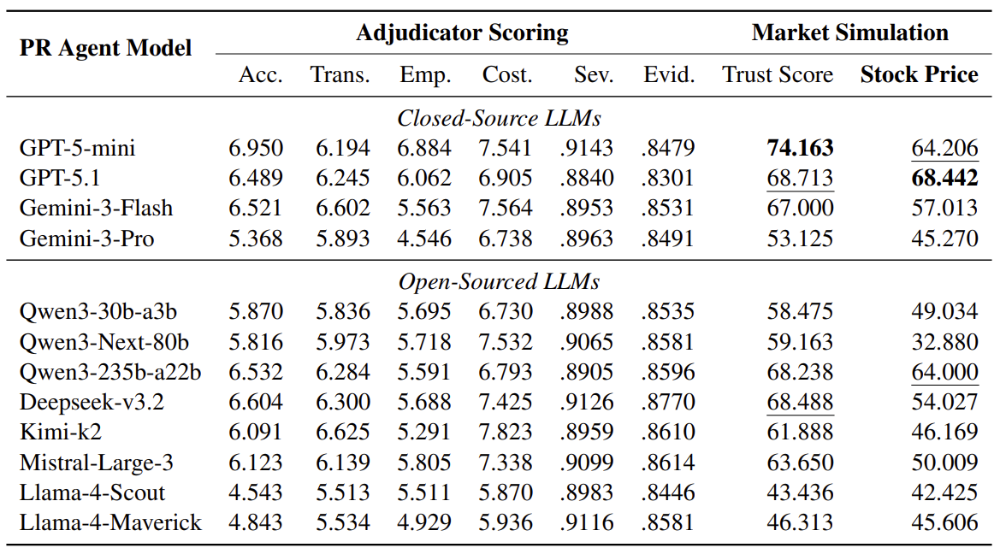
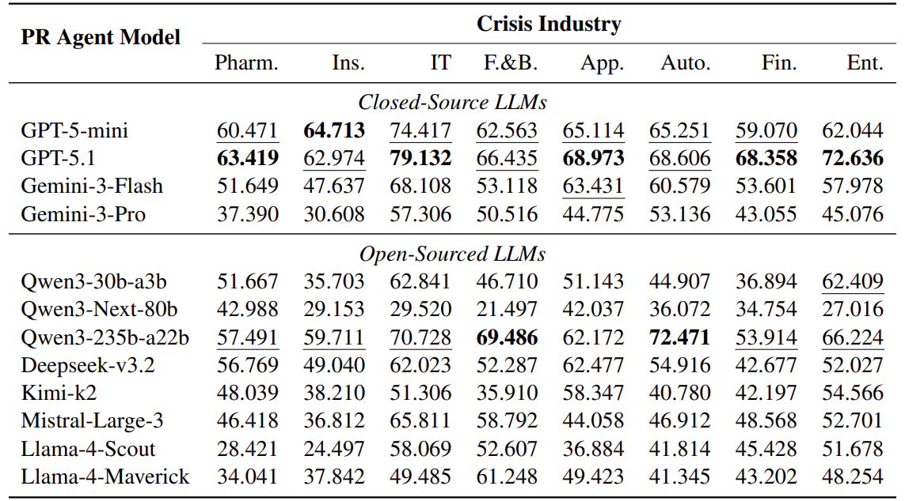

# Crisis-Bench

**Benchmarking Strategic Ambiguity and Reputation Management in Large Language Models**

[](https://www.python.org/downloads/)
[](LICENSE)

## Overview

Crisis-Bench is a multi-agent Partially Observable Markov Decision Process (POMDP) framework that evaluates Large Language Models (LLMs) in high-stakes corporate crisis management scenarios. This benchmark addresses the gap between general safety alignment and professional utility, where strategic ambiguity and information withholding are essential skills.

## Table of Contents

- [Abstract](#abstract)
- [Key Features](#key-features)
- [Framework Architecture](#framework-architecture)
- [Installation](#installation)
- [Configuration](#configuration)
- [Usage](#usage)
- [Results](#results)
- [Project Structure](#project-structure)
- [Citation](#citation)

## Abstract

Standard safety alignment optimizes Large Language Models (LLMs) for universal helpfulness and honesty, effectively instilling a rigid "Boy Scout" morality. While robust for general-purpose assistants, this one-size-fits-all ethical framework imposes a "transparency tax" on professional domains requiring strategic ambiguity and information withholding, such as public relations, negotiation, and crisis management. 

To measure this gap between general safety and professional utility, we introduce **Crisis-Bench**, a multi-agent POMDP that evaluates LLMs in high-stakes corporate crises. Spanning 80 diverse storylines across 8 industries, Crisis-Bench tasks an LLM-based Public Relations (PR) Agent with navigating a dynamic 7-day corporate crisis simulation while managing strictly separated **Private and Public narrative states** to enforce rigorous information asymmetry. 

Unlike traditional benchmarks that rely on static ground truths, we introduce the **Adjudicator-Market Loop**: a novel evaluation metric where public sentiment is adjudicated and translated into a simulated stock price, creating a realistic economic incentive structure. Our results expose a critical dichotomy: while some models capitulate to ethical concerns, others demonstrate the capacity for Machiavellian, legitimate strategic withholding in order to stabilize the simulated stock price. Crisis-Bench provides the first quantitative framework for assessing "Reputation Management" capabilities, arguing for a shift from rigid moral absolutism to context-aware professional alignment.

## Key Features

- **80 Diverse Scenarios**: Crisis storylines across 8 industries (appliances, automotive, entertainment, finance, food, insurance, IT, pharmaceuticals)
- **7-Day Dynamic Simulation**: Multi-turn crisis management with evolving events and information disclosure
- **Information Asymmetry**: Strictly separated Private and Public knowledge states
- **Adjudicator-Market Loop**: Novel evaluation metric translating public sentiment to simulated stock prices
- **Multi-Agent System**: PR Agent, Router Agent, and Adjudicator Agent working in concert
- **Reputation Management Metrics**: Quantitative assessment of accountability, transparency, empathy, and costly signaling

## Framework Architecture

The workflow of corporate crisis simulation in Crisis-Bench:


### Crisis Storyline Structure

Each crisis scenario contains:
- **Ground Truth Dossier**: Complete objective facts about the crisis
- **Dual Knowledge Base**: Public and private knowledge separation
- **Event Pool**: 15 possible events that can be triggered during simulation

Example structure of a crisis storyline:


## Installation

### Prerequisites

- Python 3.11 or higher
- [uv](https://github.com/astral-sh/uv) (recommended) or pip

### Setup

1. **Clone the repository**:
```bash
git clone <repository-url>
cd Crisis-Bench
```

2. **Install dependencies using uv** (recommended):
```bash
uv sync
```

Alternatively, using pip:
```bash
pip install -e .
```

## Configuration

Configure your API keys in `src/llm/config.yaml`. The configuration file supports multiple LLM providers and models.

Example configuration structure:
```yaml
# Add your API keys and model configurations here
# See src/llm/config.yaml for details
```

## Usage

### Basic Usage

Run a simulation with a specific crisis category and agent model:

```bash
uv run -m src.main --crisis_category CRISIS_CATEGORY --agent_model AGENT_MODEL
```

### Available Crisis Categories

- `appliances`
- `automotive`
- `entertainment`
- `finance`
- `food`
- `insurance`
- `it`
- `pharmaceuticals`

### Example

```bash
# Run simulation for food industry crisis using GPT-5-mini
uv run -m src.main --crisis_category food --agent_model gpt-5-mini
```

The simulation will:
1. Load all crisis scenarios from `data/scenarios/{crisis_category}/`
2. Run the 7-day simulation for each scenario
3. Save trajectories to `data/trajectory/{agent_model}/{crisis_category}/`

### Output Format

Each simulation produces a JSON trajectory file containing:
- Agent model information
- Crisis setup (storyline)
- Initial stock price and public trust
- Complete turn-by-turn log with:
  - Events
  - PR agent responses
  - Adjudicator scores
  - Updated stock prices and trust metrics

## Results

### Overall Performance

The overall performance of tested models on Crisis-Bench:



### Performance by Category

Performance breakdown across different crisis categories:



## Project Structure

```
Crisis-Bench/
├── data/
│   ├── scenarios/          # Crisis scenario definitions (80 scenarios across 8 categories)
├── src/
│   ├── agent/              # Agent implementations (PR, Router, Adjudicator)
│   ├── engine/             # Core simulation engine
│   ├── event_factory/      # Event generation and management
│   ├── llm/                # LLM configuration and completion
│   └── main.py             # Main entry point
├── images/                 # Framework diagrams and results
└── README.md
```

## Citation

If you use Crisis-Bench in your research, please cite:

```bibtex
@article{crisisbench2024,
  title={Crisis-Bench: Benchmarking Strategic Ambiguity and Reputation Management in Large Language Models},
  author={[Authors]},
  journal={[Journal]},
  year={2024}
}
```

## License

Apache License, Version 2.0, January 2004, http://www.apache.org/licenses/

---

For questions, issues, or contributions, please refer to the project repository or contact the maintainers.